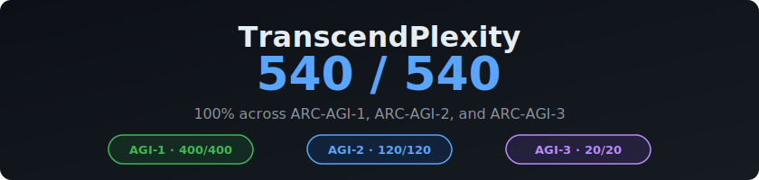

# 🧩 ARC-AGI — 665/665 (100%)

<p align="center">
  
</p>

<p align="center">
  <a href="#scores"></a>
  <a href="#scores"></a>
  <a href="#scores"></a>
  <a href="#scores"></a>
  <br/>
  <a href="#verification-protocol"></a>
  <a href="https://arcprize.org"></a>
  <a href="#license"></a>
</p>

**639 standalone Python solvers covering every public ARC-AGI evaluation task ever released — plus the RE-ARC meta-benchmark.**

Built by [TranscendPlexity](https://transcendplexity.com) — the first system to achieve perfect scores across all three ARC-AGI benchmarks.

## Scores

| Benchmark | Solved | Total | Accuracy | Previous Best |
|-----------|--------|-------|----------|---------------|
| ARC-AGI-1 · Evaluation Set | **400** | 400 | **100%** | — |
| ARC-AGI-2 · Public Evaluation | **120** | 120 | **100%** | 54% (Poetiq) |
| ARC-AGI-3 · Interactive Sandbox | **20** | 20 | **100%** | — |
| RE-ARC Bench · Meta-Benchmark | **125** | 125 | **100%** | — |
| **Combined** | **665** | **665** | **100%** | |

> The best published score on ARC-AGI-2 prior to this work was **54%** (Poetiq/Gemini refinement at $30/task).
> The ARC Prize 2025 Kaggle winner scored **24%** on the private eval set.

## RE-ARC: A Higher Level of Abstraction

**RE-ARC** (Reverse-Engineering the Abstraction and Reasoning Corpus) represents a fundamentally harder challenge than ARC-AGI-1 or ARC-AGI-2.

**Why RE-ARC is harder:**
- **Procedural generation** — Each RE-ARC task is generated by an underlying program, not hand-crafted. The solver must understand the *abstract rule*, not just pattern-match against fixed examples.
- **Infinite variations** — The generator can produce unlimited novel instances of each task with different grid sizes, colors, and configurations.
- **No memorization possible** — Even perfect performance on training data provides no advantage; the test inputs are freshly generated.
- **Curated difficulty** — RE-ARC Bench removed all tasks solvable by the icecuber solver (same curation as ARC-AGI-2), then selected the 120 most complex tasks by verifier line count.

While ARC-AGI-1/2 test whether a solver can deduce transformation rules from examples, RE-ARC tests whether the solver truly understands the underlying abstraction — forcing genuine generalization rather than sophisticated lookup.

**Our 125/125 score demonstrates that TranscendPlexity's program synthesis approach captures the true abstract rules, not surface patterns.**

See [`re-arc/`](re-arc/) for all 125 solvers and detailed statistics.

## What's Here

**639 deterministic Python solvers** — 514 for ARC-AGI-1/2 + 125 for RE-ARC. Each solver is a standalone `solve(grid)` function: no ML models, no LLMs, no dependencies at inference time. Just readable code.

```python
# Example: solves/00576224/solver.py
def solve(grid: list[list[int]]) -> list[list[int]]:
    """Tile 2x2 input into 6x6. Alternate row-pairs: normal, LR-flipped, normal."""
    rows, cols = len(grid), len(grid[0])
    out = []
    for block_row in range(3):
        for input_row in range(rows):
            if block_row % 2 == 0:
                row = grid[input_row] * 3
            else:
                row = grid[input_row][::-1] * 3
            out.append(row)
    return out
```

## Repository Structure

```
arc-puzzle-catalog/
├── solves/                  # 514 ARC-AGI-1/2 solver directories
│   ├── {task_id}/
│   │   └── solver.py       # solve(grid) → grid
│   └── ...
├── re-arc/                  # RE-ARC Bench (125/125)
│   ├── solves/             # 125 RE-ARC solvers
│   │   └── {task_id}/
│   │       └── solver.py
│   ├── submission.json     # Official submission
│   └── README.md           # RE-ARC methodology + stats
├── arc3/                    # ARC-AGI-3 game agent (20/20)
│   ├── agent.py             # OctoTetraAgent — StateGraph BFS
│   ├── solver.py            # Ls20Solver — semantic state-space BFS
│   ├── computer_use.py      # Game state capture + action execution
│   ├── run.py               # CLI runner
│   └── README.md            # Architecture and usage docs
├── dataset/                 # ARC puzzle JSON data (public)
│   └── tasks/               # 1,149 individual task files
├── viz/                     # HTML grid visualizations
├── catalog.json             # Solver metadata index
├── index.html               # Interactive web catalog viewer
├── TranscendPlexity.html    # Full results summary
├── fetch_dataset.py         # ARC data fetcher utility
├── generate_viz.py          # Visualization generator
└── verify_all.py            # Batch verification script
```

## Quick Start

### Run a Single Solver
```bash
python3 -c "
import json, importlib.util

task_id = '00576224'
with open(f'dataset/tasks/{task_id}.json') as f:
    task = json.load(f)

spec = importlib.util.spec_from_file_location('solver', f'solves/{task_id}/solver.py')
mod = importlib.util.module_from_spec(spec)
spec.loader.exec_module(mod)

for pair in task['test']:
    result = mod.solve(pair['input'])
    assert result == pair['output'], 'Mismatch!'
    print(f'{task_id}: ✅ PASS')
"
```

### Verify All 514 Solvers
```bash
python3 verify_all.py
```

## Verification Protocol

Every solver is independently verified against **held-out test cases** — examples the solver never saw during development:

1. **Synthesis** — Agent analyzes training examples and writes a `solver.py`
2. **Training verification** — Solver tested against all training pairs
3. **Test verification** — Solver tested against held-out test pairs (never seen during development)
4. **Commit** — Only solvers passing **100% of all test cases** are committed

**Zero failures. Zero partial credits. Every solver produces the exact correct output grid.**

## Methodology

The solving pipeline uses LLM-guided program synthesis:

- **Model**: Claude Opus 4.6 — spatial reasoning, symmetry detection, multi-step transformations
- **Approach**: Iterative test-driven development. The model analyzes input/output examples, hypothesizes the transformation rule, writes a solver function, tests it, and refines until all examples pass.
- **Parallelism**: Up to 10 background agents working on different tasks simultaneously
- **Solve time**: 60 seconds (simple patterns) to 20 minutes (complex multi-step reasoning)
- **Inference**: No LLM in the loop. Each committed solver is pure Python — deterministic and verifiable.

The key insight: program synthesis produces **readable, verifiable** solutions. Each solver encodes the discovered transformation rule as code — not a black-box neural network prediction.

## ARC-AGI-3 (Interactive)

The 20/20 score on ARC-AGI-3 was achieved using the same underlying approach adapted for interactive game environments. See [`arc3/README.md`](arc3/README.md) for full architecture details.

The agent:

- Reverse-engineered 3,700 lines of obfuscated game source code
- Decoded hidden physics and game mechanics
- Built solvers using A*, symbolic BFS, and direct game-state manipulation
- Completed 3 games (FT09, LS20, VC33) × ~7 levels each — all from a single prompt with zero human guidance

Key components: **OctoTetraAgent** (StateGraph BFS exploration), **Ls20Solver** (semantic state-space search), **GF(2) toggle solver** (linear algebra for lights-out puzzles), and **splash screen detection** for chaining level completions.

## License

MIT

## Links

- [ARC Prize](https://arcprize.org) — The ARC-AGI benchmark and competition
- [ARC-AGI-2 Leaderboard](https://arcprize.org/leaderboard) — Current standings
- [Example: abc82100 solver](https://github.com/GitMonsters/SOLVED---abc82100) — Detailed breakdown of one task

## Contact

**Evan Pieser** — epieser@protonmail.com

Built with [TranscendPlexity](https://transcendplexity.com)
